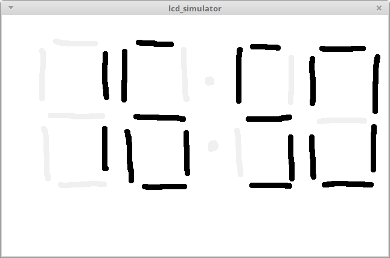

# lcd simulator

The purpose of this tool is to simulate a HDL module defining the behaviour of a LCD-system and display it in a GUI with custom drawn LCD segments. The goal is to create simple systems such as a clock or a Game-and-Watch game.

It works by simulating a verilog module describing the behaviour of the LCD-system, the GUI will load a custom segment file, and each output of the verilog module will drive a segment of the LCD on the GUI.

This tool works by using three file:
- verilog definition of the system with inputs and outputs
- png of the segments
- json linking the position of the segments and the inputs

```
+-----------------+                +---------------+           +------------------+     +-----------+
| top.v           |                |               | segments  |                  |     |           |
| - clk           |  verilator     |  Vtop.cpp     +----------->  Simulation      |     |           |
| | 16 inputs     +--------------->+               |           |  loop            +-----+ gui       |
| - 256 outputs   |                |               |clk, inputs|                  |     |           |
|                 |                |               <-----------+                  |     |           |
|                 |                |               |           |                  |     |           |
+---+-------------+                +---------------+           +--------+---------+     +-----+-----+
    ^                                                                   |                     |
    |                                                          +--------+---------+           |
    +verilog                                                   |                  |           |
    |submodule            7seg folder                          | Init             +-----------+
    |            +-----------------------------------+         |                  |
    |            |                                   |         +--+-----+---------+
    |            |                  +--------------+ |            |     |
    |            | +------------+   |              | |            |     |
    |            | |            |   | segments.png +--------------+     |
    |            | | segments.v |   |              | |                  |
    +--------------+            |   +--------------+ |                  |
                 | |            |                    |                  |
                 | |            |   +--------------+ |                  |
                 | +------------+   |              | |                  |
                 |                  | segments.json+--------------------+
                 |                  |              | |
                 |                  +--------------+ |
                 |                                   |
                 +-----------------------------------+
```

The verilog file is transformed into a cpp class using verilator, the class represents the behaviour of the verilog file.
The verilog file for a simulation is used as a submodule to the top.v file which shouldn't be modified. It has a clk input, 16 user inputs and 256 outputs for the segments.
In the case of the 7seg example, there are two inputs (one for reset, the other to "light up" the two dots between the minutes and seconds) and 30 outputs (4 * 7segments + 2dots).

Segments are drawn beforehand in a PNG file. A segment is defined as a contiguous area of black pixels.

The link between the segments drawn in the gui and the outputs of the verilog is done with the json file. It contains a list of segments such as:
`{"posx":580, "posy":55, "output":0}`
which tells the position of one of the pixel in the segment and to which output of the verlog module it should be mapped. Here the segment with one of its pixel at (580, 55) will be bind to the 0th bit of the verilog output. When the verilog module will output a '1' to output[0] the segment will get black on the gui.
The json also contains a list of inputs in the form of:
`{"key":"a", "input":0}`
it has a similar definition as the segments, it tells that when the user presses the key 'a' the bit 0 of the 16bit input to the module will be 1.

In the 7seg example, four counters are incremented each clock to be displayed on each of the four 7segments in the `7seg/segments.png` file.



## How to build

This tool was developped and tested on a Linux Mint 18.2

Needed tools:
- Verilator 3.874
- Qt 5.5

The `build.sh` should run the verilator, and build the cpp code.
